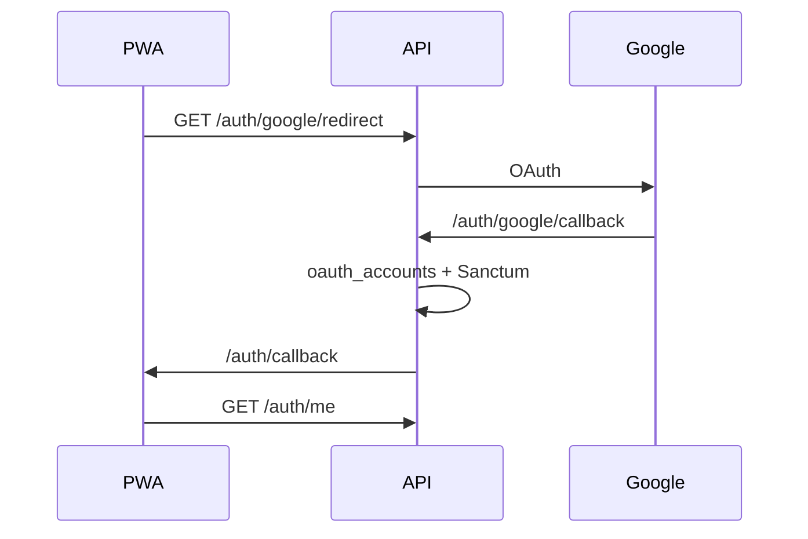

# Auth social (Socialite) — plataforma

Login social vía OAuth para la PWA. **No es un dominio de negocio.** Amplía [platform-shared.md](./platform-shared.md).

## Estado

| Pieza | Estado |
|-------|--------|
| Flujo | PWA + **redirect Socialite** (no nativo Capacitor aún) |
| Provider activo | `google` |
| Extensión | Rutas `{provider}` + tabla `oauth_accounts` + `OAUTH_PROVIDERS` |
| Sesión | Mismo contrato que login: Sanctum → `{ user, token, proveedor }` |

## Flujo

1. PWA `/auth` → botón **Continuar con Google** → `GET {API_URL}/auth/google/redirect`
2. Google consent → `GET {API_URL}/auth/google/callback`
3. API resuelve/vincula usuario, emite token Sanctum
4. Redirect a `{APP_FRONTEND_URL}/auth/callback#token=…&pending_registro=0|1`
5. Front guarda token, llama `/auth/me`, `SessionService.startSession`
6. Si `pending_registro=1` → navega a `/pages/proveedor/perfil` (Mi Empresa) para completar datos

Token en **hash** (no query) para reducir fuga por Referer.

Socialite en API usa `stateless()` (rutas `api.php` sin sesión web).



## Reglas de negocio

1. Buscar `oauth_accounts` por `provider` + `provider_id`
2. Si no hay: buscar `users` por email → **auto-vincular** cuenta OAuth
3. Si no hay user: crear **GERENTE** + **proveedor stub** (datos mínimos desde Google) + pivot PRINCIPAL (sin sucursal Matriz en OAuth: evita lock `mysql`/`mysql5` en `sucursales`)
4. Respetar `UserCuentaEstado` (bloqueado/suspendido)
5. `pending_registro=1` si el proveedor no tiene `perfil_empresa_completo` / `registro_completado_at` → PWA abre **Mi Empresa** (`/pages/proveedor/perfil`)

> En BD local **no** existe rol `USUARIO`; el alta social usa `GERENTE` (id 3).

## Google Cloud (pasos)

1. Proyecto (puede reutilizar `APP-PROVEEDORES-NOTIFICACION` / FCM)
2. Pantalla de consentimiento OAuth (scopes email, profile, openid)
3. Cliente **Aplicación web**
4. **Orígenes JS** (PWA, sin path):
   - `http://localhost:4300`
   - `https://app.gestionplus.com.mx`
   - `https://gestion.heventec.com`
5. **URIs de redirección** (API + `/api` + callback):
   - Local: `http://localhost:8088/api/auth/google/callback`
   - Prod API: la URL pública real de Laravel, p. ej. `https://gestion.heventec.com/api/auth/google/callback` **o** `https://apicons.ddns.net:8092/api/auth/google/callback` según dónde responda la API
6. Copiar Client ID / Secret al `.env` (**nunca** al repo ni al JSON de Downloads en Git)

> Importante: las URIs deben coincidir **exactamente** con `GOOGLE_REDIRECT_URI`. Si configuraste `http://localhost:8088/auth/google/callback` sin `/api`, hay que corregirlo en Google Cloud.

## Variables `.env` (API)

```env
OAUTH_PROVIDERS=google
OAUTH_FRONTEND_CALLBACK="${APP_FRONTEND_URL}/auth/callback"
GOOGLE_CLIENT_ID=
GOOGLE_CLIENT_SECRET=
GOOGLE_REDIRECT_URI="${APP_URL}/api/auth/google/callback"
APP_FRONTEND_URL=http://localhost:4300
```

`config/services.php`: bloques `oauth` y `google`.

## Código API

| Pieza | Ubicación |
|-------|-----------|
| Paquete | `laravel/socialite` |
| Rutas | `routes/segmented/auth.php` → `GET auth/{provider}/redirect\|callback` |
| Controller | `App\Http\Controllers\Auth\SocialAuthController` |
| Servicio | `App\Services\Auth\SocialAuthService` |
| Modelo | `App\Models\OauthAccount` + `User::oauthAccounts()` |
| Migraciones | `create_oauth_accounts_table`, `make_users_password_nullable` |

Añadir provider futuro: driver Socialite (+ Socialite Providers si hace falta), credenciales en `services.php`, valor en `OAUTH_PROVIDERS`.

Hueco futuro (nativo): `POST /auth/{provider}/token` con ID token — mismo `SocialAuthService::resolveAuthenticatedUser`.

## Código PWA (`app-proveedores`)

| Pieza | Ubicación |
|-------|-----------|
| Botón | `@auth/login` → `loginWithProvider('google')` (estilo Identity) |
| Callback | `/auth/callback` → `@auth/oauth-callback` |
| Config | `environment.oauthProviders: ['google']` |
| Routing | En `app-routing`, `auth/callback` **antes** de `auth` `path: ''` (login); si no, NG04002 |
| Token | Tras OAuth: `UserStore.setToken` (el interceptor usa `token$`; solo `TokenService` deja `/auth/me` en 401) |
| Mi Perfil | Badge Google junto al rol (campos `oauth_providers` / `auth_google`) |
| Admin | Tag + filtro `oauth_provider` en usuarios y empresas |

## Checklist de puesta en marcha

- [ ] URI de callback correcta en Google Cloud (con `/api`)
- [ ] `.env` con Client ID/Secret y `GOOGLE_REDIRECT_URI`
- [ ] `php artisan migrate` (oauth_accounts + password nullable)
- [ ] Usuarios de prueba en consent screen (modo Testing)
- [ ] Probar: usuario existente por email; usuario nuevo → `/reg`
- [ ] **Windows local:** si aparece `cURL error 60` al hablar con Google, configurar CA en `php.ini` del **mismo PHP que sirve la API** (no solo CLI):

```ini
curl.cainfo = "C:/Php/cacert.pem"
openssl.cafile = "C:/Php/cacert.pem"
```

Descargar bundle: https://curl.se/ca/cacert.pem — luego **reiniciar Apache/IIS/php-fpm**.

## Qué no mezclar

- No Firebase Auth (FCM es solo push)
- No lógica de catálogo / SP / presupuestos en este flujo
- No commitear `client_secret_*.json`

## Nota técnica (locks)

`OauthAccount` extiende `BaseModel` pero con `$connection = null` (default, igual que `User`), no `mysql5`. Evitar transacciones / writes que mezclen conexiones distintas sobre `users` ↔ `oauth_accounts` ↔ `sucursales`: provoca `Lock wait timeout exceeded`.
