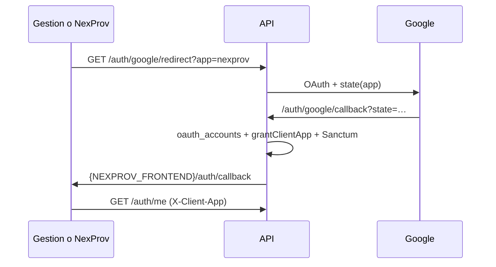

# Auth social (Socialite) — plataforma

Login social vía OAuth para las PWAs (GestionPlus / NexProv). **No es un dominio de negocio.** Amplía [platform-shared.md](./platform-shared.md) y [platform-client-apps.md](./platform-client-apps.md).

## Estado

| Pieza | Estado |
|-------|--------|
| Flujo | PWA + **redirect Socialite** (no nativo Capacitor aún) |
| Provider activo | `google` |
| Multi-app | `?app=` + OAuth **state** firmado → `grantClientApp` + redirect a la PWA correcta |
| Extensión | Rutas `{provider}` + tabla `oauth_accounts` + `OAUTH_PROVIDERS` |
| Sesión | Mismo contrato que login: Sanctum → `{ user, token, proveedor }` |

## Flujo

1. PWA → **Continuar con Google** → `GET {API_URL}/auth/google/redirect?app={gestion|nexprov}`
2. API guarda en **cache** (`oauth.client_app.{nonce}`) la app + URL de callback, y pone eso en **state** OAuth firmado
3. Google consent → `GET {API_URL}/auth/google/callback?state=…`
4. API lee cache/state → **`grantClientApp(app)`** → token Sanctum
5. Redirect a la URL guardada (`…/auth/callback#token=…`) — NexProv a `:4400`, Gestion a `:4300`
6. Front guarda token, llama `/auth/me` (con `X-Client-App`), `SessionService.startSession`
7. Si `pending_registro=1` → navega a Mi Empresa / perfil

Token en **hash** (no query) para reducir fuga por Referer.

Socialite en API usa `stateless()` (rutas `api.php` sin sesión web). El `state` custom no usa sesión web.



## Reglas de negocio

1. Buscar `oauth_accounts` por `provider` + `provider_id`
2. Si no hay: buscar `users` por email → **auto-vincular** cuenta OAuth
3. Si no hay user: crear **GERENTE** + **proveedor stub** (datos mínimos desde Google) + pivot PRINCIPAL (sin sucursal Matriz en OAuth: evita lock `mysql`/`mysql5` en `sucursales`)
4. Respetar `UserCuentaEstado` (bloqueado/suspendido)
5. **Otorgar** `user_client_apps` para la `app` del state (Google = prueba de posesión del email)
6. `pending_registro=1` si el proveedor no tiene `perfil_empresa_completo` / `registro_completado_at` → PWA abre **Mi Empresa**

> En BD local **no** existe rol `USUARIO`; el alta social usa `GERENTE` (id 3).

Si el `state` es inválido o falta → `app = gestion` (default).

## Google Cloud (pasos)

1. Proyecto (puede reutilizar `APP-PROVEEDORES-NOTIFICACION` / FCM)
2. Pantalla de consentimiento OAuth (scopes email, profile, openid)
3. Cliente **Aplicación web**
4. **URIs de redirección** — **solo la API** (una URI; no hace falta registrar cada PWA):
   - Local: `http://localhost:8088/api/auth/google/callback`
   - Prod: la URL pública real de Laravel + `/api/auth/google/callback`
5. Orígenes JS: **opcionales** en este flujo (redirect server-side). No son lo que decide a qué front vuelve.
6. Copiar Client ID / Secret al `.env` (**nunca** al repo ni al JSON de Downloads en Git)

> Importante: las URIs deben coincidir **exactamente** con `GOOGLE_REDIRECT_URI`. Si configuraste el callback sin `/api`, hay que corregirlo en Google Cloud.

## Variables `.env` (API)

```env
OAUTH_PROVIDERS=google
GOOGLE_CLIENT_ID=
GOOGLE_CLIENT_SECRET=
GOOGLE_REDIRECT_URI="${APP_URL}/api/auth/google/callback"
APP_FRONTEND_URL=http://localhost:4300
NEXPROV_FRONTEND_URL=http://localhost:4400
```

`OAUTH_FRONTEND_CALLBACK` ya no decide el destino multi-app (queda el redirect por `ClientApp::frontendPathFor`).

`config/services.php`: bloques `oauth` y `google`.  
`config/client_apps.php`: `frontend_url` por app.

## Código API

| Pieza | Ubicación |
|-------|-----------|
| Paquete | `laravel/socialite` |
| Rutas | `routes/segmented/auth.php` → `GET auth/{provider}/redirect\|callback` |
| Controller | `App\Http\Controllers\Auth\SocialAuthController` (`?app=` → state) |
| Servicio | `App\Services\Auth\SocialAuthService` (state firmado, grant, callback por app) |
| Modelo | `App\Models\OauthAccount` + `User::oauthAccounts()` / `grantClientApp()` |
| Migraciones | `create_oauth_accounts_table`, `make_users_password_nullable` |

Añadir provider futuro: driver Socialite (+ Socialite Providers si hace falta), credenciales en `services.php`, valor en `OAUTH_PROVIDERS`.

Hueco futuro (nativo): `POST /auth/{provider}/token` con ID token — mismo `SocialAuthService::resolveAuthenticatedUser` (+ `app` en body).

## Código PWA

| App | Pieza |
|-----|--------|
| GestionPlus | `@auth/login` y `@auth/login-split` → `loginWithProvider` con `?app=gestion` |
| NexProv | `@auth/login` → `?app=nexprov` |
| Ambas | `/auth/callback` → oauth-callback; `environment.clientApp` + `oauthProviders` |

Routing: `auth/callback` **antes** de `auth` `path: ''` (login); si no, NG04002.  
Token: tras OAuth, `UserStore.setToken` (el interceptor usa `token$`).

## Checklist de puesta en marcha

- [ ] URI de callback correcta en Google Cloud (con `/api`) — **solo API**
- [ ] `.env` con Client ID/Secret, `GOOGLE_REDIRECT_URI`, `APP_FRONTEND_URL`, `NEXPROV_FRONTEND_URL`
- [ ] `php artisan migrate` (oauth_accounts + password nullable)
- [ ] Usuarios de prueba en consent screen (modo Testing)
- [ ] Probar desde Gestion (`:4300`) y desde NexProv (`:4400`) → vuelve a la misma PWA
- [ ] **Windows local:** si aparece `cURL error 60`, CA en `php.ini` del PHP que sirve la API:

```ini
curl.cainfo = "C:/Php/cacert.pem"
openssl.cafile = "C:/Php/cacert.pem"
```

Descargar bundle: https://curl.se/ca/cacert.pem — luego **reiniciar Apache/IIS/php-fpm**.

## Qué no mezclar

- No Firebase Auth (FCM es solo push)
- No lógica de catálogo / SP / presupuestos en este flujo
- No commitear `client_secret_*.json`
- No registrar URLs de PWA como redirect URI de Google (el front lo elige la API)

## Nota técnica (locks)

`OauthAccount` extiende `BaseModel` pero con `$connection = null` (default, igual que `User`), no `mysql5`. Evitar transacciones / writes que mezclen conexiones distintas sobre `users` ↔ `oauth_accounts` ↔ `sucursales`: provoca `Lock wait timeout exceeded`.
